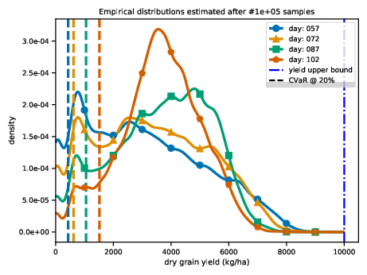

# Optimal Thompson Sampling strategies for support-aware CVaR bandits 2021 ICML submission repository

***

## *Meanwhile, a better adaptation of DSSAT for bandits/RL has been released. It allows to interact on a daily basis with DSSAT, in an MDP fashion trough an OpenAI gym environment, with better efficiency.*
<center> <a href="https://gitlab.inria.fr/rgautron/gym_dssat_pdi"></a> </center>

***

This respository contains:
+ A bandit-oriented [*Decision Support System for Agrotechnology Transfer* (DSSAT)](https://dssat.net/) fortran crop-model Python integration in an [OpenAI gym](https://gym.openai.com/) based [gym-dssat](#packagesgym_dssat) environment designed to be easily reused by researchers. An example of use is presented in [Section 4](#4-use-of-the-gym-dssat-integration).

+ The [code to reproduce *Optimal Thompson Sampling strategies for support-aware CVaR bandits*](#dssatbandits) DSSAT crop-model experiments.

+ Description of prerequirements and custom packages

This page provides an overall documentation, and each function is individually documented in the source code. **The code found in this repository is only valid for Linux based systems und uses Python3** (in case you do not have Python3 with pip, you can install it with ```sudo apt-get install python3-pip```).

## 1] Prerequirements
All the installations in this section are necessary to run the code to reproduce *Optimal Thompson Sampling strategies for support-aware CVaR bandits* experiments and/or reuse the custom made DSSAT bandit integration.
### DSSAT
To install DSSAT under Linux, you can use ```install_dssat.sh``` in this repository root folder; default installation is at ```~/dssat``` .
If you want a different location, please change the ```-DCMAKE_INSTALL_PREFIX``` flag in ```install_dssat.sh``` ; if location has to be changed from default, it has to be indicated to the DSSAT integration as exposed in [Section 4](#4-use-of-the-gym-dssat-integration)

To install DSSAT with ```install_dssat.sh```:

```shell
chmod +x install_dssat.sh
bash install_dssat.sh
```

You can check that DSSAT correctly works with:

```shell
cd /tmp
cp ~/dssat/Maize/UFGA8201.MZX .
~/dssat/run_dssat C UFGA8201.MZX 1 # run experiment nb 1 from UFGA8201.MZX file
```

### Python external libraries
You will need under Python3 using pip3: ```joblib```, ```jinja2```, ```tqdm```,  ```matplotlib```, ```seaborn``` and the ```gym``` packages. If you need to install those packages, you can find the script ```install_external_packages.sh``` located in the repository root folder for automated installation.
```shell
chmod +x install_external_packages.sh
bash install_external_packages.sh
```

### Python custom made libraries
Custom made packages are located in  ```./packages```.

To install at once all the custom made packages from ```./packages```, you can use ```install_packages.sh``` located in ```./packages``` doing:

```shell
chmod +x install_packages.sh
bash install_packages.sh
```

#### ```./packages/cvarBandits```
Contains bandits algorithms. The base class is defined in ```./bandits/bandit_base.py```

#### ```./packages/dssatUtils```
Connection between DSSAT and Python in "bandit mode".
```./dssatParsing``` contains functions to read DSSAT specific input files.
```./dssatIntegration``` contains the core of the DSSAT to Python connection.

#### ```./packages/gym_dssat```
The gym-DSSAT environment is an [OpenAI gym](https://gym.openai.com/) encalpsulation of ```../dssatUtils/dssatIntegration```. The following image provides an example of the kind of bandit arm distributions the gym-DSSAT environment can generate.



The use of the environment is shown in [Section 4](#4-use-of-the-gym-dssat-integration)
.
## 2] Running the experiment *Optimal Thompson Sampling strategies for support-aware CVaR bandits*
### ```./dssatBandits/exps``` contains the source code of *Optimal Thompson Sampling strategies for support-aware CVaR bandits* DSSAT experiments.

To launch an experiment, run ```python3 ./run_dssat_experiment.py``` if main's ```args_from_shell``` is set to ```False```,
else run for example ```python3 ./run_dssat_experiment.py 1 10000 1040 True 1000000``` where:

```
exp_nb = int(sys.argv[1])  # in the example 1, the number of the experiment to be run, defined by exp_dicts in main
horizon = int(sys.argv[2])  # in the example 10000, the bandit horizon of the experiment to be run
replications = int(sys.argv[3])  # in the example 1040, the number of replications of the experiment to be run
sampling = eval(sys.argv[4])  # in the example True, if DSSAT arm sampling has to be performed
n_samples = int(sys.argv[5])  # in the example 1000000, the number of samples by arm for DSSAT arm sampling
```
        
## 3] Notes on the use of the gym-DSSAT integration for reuse purposes
### Basic use of gym-DSSAT
```gym_dssat``` consists in an encapsulation of a Python program which writes DSSAT input files, executes the fortran-based DSSAT crop-simulator and reads its output files.

When a gym_dssat env is generated, a temporary folder is created for DSSAT's execution. Before deleting the environment, use ```env.dssat.close()``` to remove the folder in ```/tmp```. If you want a new temporary folder for parellel execution, first call ```env.dssat.make_tmp_folder()``` in the function to be parallelized.

The recommended form to use ```gym_dssat``` is:

```python
try:
    env = ... #  initiliaze the env, and perform some computations
finally:
    env.dssat.close()  # delete the temporary folder and temporary file
```

An example of ```gym_dssat``` environment practical use for maize growth simulation is:
```python
from gym_dssat.envs.dssat_env import DssatEnv

dssat_param_dic = {
    'fileX_prefix':   'UFGA8201', # the name of the .jinja template file, which contains all configs
    'fileX_extension':'MZX',  # the extension of the fileX for maize
    'id_soil':        'HC_GEN0027',  # the soil to be used in simulations
    'output':         'HWAM',  # dry grain yield DSSAT output as reward
    'sdate':          '82056',  # simulation beginning date, 'YYDDD' julian format
    'icdat':          '82056', # date of soil initial conditions measures, 'YYDDD' julian format
    'planting_date':  '82057',  # the reference planting date
    'random_weather': True,  # if you want randomness in weather each time env.step() is called thanks to DSSAT's WGEN internal daily weather generator
    'random_soil':    False,  # if a random soil is sampled each time env.step() is called. Requires soil_path argument to be provided
    'ingeno':         'PC0005', # the name of the cultivar to be grown
    'files_prefix':   './dssat_files/' # eventually a subfolder containing all DSSAT related input_files (e.g. .jinja file)
}

env_param_dic = {
    'cultivar':       False, # if an action is made on cultivar choice. Requires cultivar_path argument in dssat_param_dic to be provided.
    'sowing_date':    True,  # if an action is made on planting date, if cultivar option activated, an action is a combinaison. 
    'stateless':      True,  # if you want to retrieve a context
    'date_steps':     6, # the number of dates spaced by 'date_delta' from the initial planting date you want for actions
    'date_delta':     15, # the time interval in days between planting dates
    'is_cvar':        True,  # if the CVaR at level alpha is action choice criteria, else the mean is considered
    'alpha':          .3,  # alpha level of the CVaRs
    'n_samples':      1e6,  # the number of samples for considered actions to estimate their cvar
    'eta_max':        10000   # maximum yield: the upper bound of yield rewards
}

try:
    env = DssatEnv() # initialize the gym env
    env._init_(dssat_param_dic=dssat_param_dic, env_param_dic=env_param_dic) # configure the DSSAT environment and integration.
    env.get_dist_params(loading_path='./dssat_files/dssat_samples.pkl') # ifs loading_path is given, precomputed samples can be used ; if saving_path is given, samples are collected and stored where indicated (stored as a pickle file)
    env.render_env(saving_path='env_figs/dssat_render.png') # plot the environments reward distributions
    context, reward, _, _ = env.step(action_index=0)  # make the first possible action and observe the reward. Action are passed with their index. The reward variable is an array of a single float. If env.stateless is True, the returned context is None.
finally:
    env.dssat.close()
```

*You can find all tunable parameters in ```/packages/dssatUtils/dssat_integration/dssatIntegration.py```.*

After ```env.get_dist_params()``` has been called, environment comes with 3 attributes:
```python
env.true_params # empirical cvar values for all actions if env.is_cvar is True, else the means
env.cvars # CVaRs for all actions at level env.alpha
(env.cvar_cis) # Optional: CVaRs confidence bounds for all actions at level env.alpha at confidence level env.delta
env.means # mean values for all actions
```

To know what are possible actions to make and what they mean:

```python
available_actions =  range(env.n_actions)  # to feed the env.step function by index
action_values =  env.action_values  # how each action index is translated to DSSAT crop-model, e.g. action of index 0 corresponds to a given (planting_date, cultivar)
```

**If DSSAT is located in another folder than ~/dssat, you should specify its location thanks to ```dssat_location``` argument in ```dssat_param_dic```**

### Additional gym-DSSAT  options
If you want actions to be made with cultivar choice, you have to provide a csv containing possible choices, and indicate the location of the csv. Same principle if ```random_soil``` is True, respectively for soil random choice.


Examples of csv files are provided in ```/exps/dssatBandits/dssat_files``` with ```cultivars.csv``` and ```soil.csv```, and use indicated below:


```python
dssat_param_dic = {
    'random_soil':   True,  # if a random soil is sampled each time env.step() is called. Requires soil_path argument to be provided
    'soil_path':     'soils.csv',  # the path of the csv of available soils for random choice, without files_prefix if provided
    'cultivar_path': 'cultivars.csv',  # the path of the csv of available cultivars, without files_prefix if provided
    'files_prefix':  './dssat_files/',  # eventually a subfolder containing all DSSAT related input_files (e.g. .jinja file, csv input_files)
}

env_param_dic = {
    'cultivar':     True, # if an action is made on cultivar choice. Requires cultivar_path argument in dssat_param_dic to be provided.
}
```